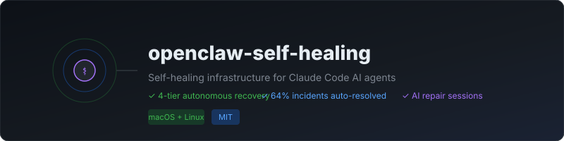

<div align="center">

# OpenClaw 자가복구 시스템

### 장기 실행 서비스를 위한 자율 크래시 복구

**새벽 3시 알림 대신, 기계가 뻔한 수습을 먼저 하게 하세요.**

[](https://github.com/Ramsbaby/openclaw-self-healing/releases)
[](#빠른-시작)
[](LICENSE)
[](https://github.com/ramsbaby/openclaw-self-healing/stargazers)
[](#실제-운영-수치)
[](#prometheus-메트릭)
[](https://github.com/Ramsbaby/openclaw-self-healing/actions/workflows/lint.yml)

[빠른 시작](#빠른-시작) · [작동 방식](#작동-방식) · [알려진 한계](#알려진-한계) · [문서](#문서)

[English README →](README.md)

</div>

<p align="center">
  
</p>

---

## 이게 뭔가요

장기 실행 서비스에 5단계 복구 사다리를 씌우는 셸 스크립트 모음입니다.

단순 watchdog은 죽은 프로세스를 되살립니다. 재시작으로 고쳐지지 않는 원인(설정 파일 손상, 키 누락, 깨진 의존성) 앞에서는 그 재시작이 크래시 루프가 되고, 결국 알림을 받게 됩니다.

이 시스템에는 단순 watchdog에 없는 두 가지가 있습니다. **시작 전 검증**(Level 0)과 **AI 진단 세션**(Level 3)입니다. Level 3은 실제 로그와 설정을 읽은 뒤 수리를 시도하고, 그래도 실패하면 로그 경로를 붙여 사람에게 넘깁니다.

[OpenClaw Gateway](https://github.com/openclaw/openclaw)를 대상으로 만들어졌고 그 환경에서 검증했습니다. 구조 자체는 OpenClaw 전용이 아니지만(서비스 명령·포트·경로를 환경 변수로 받습니다), 다른 서비스에 적용하려면 지금은 설정 변경이 아니라 스크립트 수정이 필요합니다.

---

## 데모

<div align="center">


*복구 사다리 실제 동작: KeepAlive → Watchdog → AI 진단 → 알림*

</div>

---

## 작동 방식

### 5개 계층

| 계층 | 구성 요소 | 트리거 | 동작 |
|---|---|---|---|
| **0** | `gateway-preflight.sh` | 매 콜드스타트 | 게이트웨이 바이너리·`node`·`.env` 키·JSON 설정을 검증하고 정상 설정을 백업한 뒤 게이트웨이를 `exec`. 실패 시 AI 복구 세션을 열고 백오프(30초 → 90초 → 180초), 6시간당 최대 3회 |
| **1** | 게이트웨이 자체 서비스 유닛 | 모든 크래시 | 즉시 재시작(0~30초). OpenClaw Gateway의 LaunchAgent/systemd 유닛이 담당 — **이 프로젝트가 설치하지 않음** |
| **2** | `gateway-watchdog.sh` (3분)<br>`gateway-healthcheck.sh` (5분) | 반복 크래시 | PID + HTTP + 메모리 점검, 지수 백오프, 6시간 후 크래시 카운터 감쇠, 설정 스키마 오류 시 `openclaw doctor --fix` 자동 실행. 30분 연속 실패하면 Level 3으로 승격 |
| **3** | `emergency-recovery-v2.sh` | 30분 연속 실패 또는 Level 0 실패 | Claude Code CLI를 `tmux` PTY 세션으로 띄워 로그·설정을 읽고 진단·수리. 리포트를 남기고 누적 학습 파일에 추가 |
| **4** | 알림 라이브러리 | 모든 자동화 소진 | 실패 사유와 로그 경로를 담아 Discord / Slack / Telegram 발송 |

```
Level 0: Preflight              (매 콜드스타트)
│  바이너리 · node · .env 키 · JSON 설정 검증 → 백업 → 게이트웨이 exec
│  실패 시: AI 복구 세션 + 백오프(30초 → 90초 → 180초) → exit 1
▼  통과
Level 1: KeepAlive              (0~30초)
│  OpenClaw Gateway 서비스 유닛이 제공
▼  반복 실패
Level 2: Watchdog + HealthCheck (3~5분)
│  3분마다 HTTP + PID + 메모리 · 5분마다 HTTP 폴링
│  백오프: 10초 → 30초 → 90초 → 180초 → 300초 → 600초
│  크래시 카운터 6시간 후 감쇠
▼  30분 연속 실패
Level 3: AI 긴급 복구           (5~30분)
│  tmux PTY 세션: 로그 읽기 → 진단 → 수정 → 리포트 작성
▼  모든 자동화 실패
Level 4: 사람 알림
   Discord / Slack / Telegram + 사유 + 로그 경로
```

### 설치 프로그램이 실제로 연결하는 것

다이어그램보다 이쪽이 중요합니다. 설치 프로그램은 스크립트 5종과 공용 라이브러리 2종을 모두 내려받지만, 실제로 등록하는 스케줄 유닛은 **2개뿐**입니다.

| 계층 | 스크립트 설치 | 스케줄 등록 | 비고 |
|---|:---:|:---:|---|
| 0 Preflight | O | **X** | 게이트웨이의 LaunchAgent/systemd 유닛이 `gateway-preflight.sh`를 실행하도록 직접 바꿔야 합니다. [Level 0 활성화](#level-0-활성화) 참고 |
| 1 KeepAlive | 해당 없음 | **X** | OpenClaw Gateway 서비스 소관. 이미 있다고 전제 |
| 2 Watchdog | O | O | `ai.openclaw.watchdog`, 180초 주기 |
| 2 HealthCheck | O | O | `com.openclaw.healthcheck`, 300초 주기 |
| 3 AI 복구 | O | 요청 시 | Level 2가 호출, 스케줄 아님 |
| 4 알림 | O | 요청 시 | 실패한 계층이 호출 |

---

## 직접 만드는 것과 비교

| | 기본 watchdog | supervisord | openclaw-self-healing |
|---|:---:|:---:|:---:|
| 크래시 시 자동 재시작 | O | O | O |
| HTTP 헬스 폴링 | X | X | O |
| 크래시 루프 백오프 | X | 부분 | O, 지수 백오프 |
| 시작 전 설정 검증 | X | X | O (Level 0) |
| AI 근본 원인 진단 | X | X | O (Claude Code CLI) |
| 손상된 설정 자동 수정 | X | X | O (`openclaw doctor --fix`) |
| 멀티채널 알림 | X | X | Discord / Slack / Telegram |
| Prometheus 메트릭 | X | X | O |
| macOS + Linux + Docker | 부분 | O | O |

핵심 차이는 하나입니다. 재시작만으로 풀리지 않는 크래시 루프에서 다른 도구는 사람을 부르지만, 이 시스템은 로그를 먼저 읽어봅니다.

---

## 먼저 체험하기 (드라이런)

설치 프로그램이 무엇을 할지 미리 봅니다. 아무것도 기록하지 않습니다.

```bash
curl -fsSL https://raw.githubusercontent.com/Ramsbaby/openclaw-self-healing/main/install.sh | bash -s -- --dry-run
```

실제 출력:

```
[Step 2] Scripts that would be downloaded to
         ~/.openclaw/skills/openclaw-self-healing/scripts/ :
   📄 gateway-preflight.sh          (Level 0 — config validation wrapper)
   📄 gateway-watchdog.sh           (Level 2 — reactive watchdog)
   📄 gateway-healthcheck.sh        (Level 2 — HTTP health polling)
   📄 emergency-recovery-v2.sh      (Level 3 — AI autonomous recovery)
   📄 emergency-recovery-monitor.sh (Level 3 — recovery session monitor)
   📄 lib/notify.sh                 (Discord / Slack / Telegram dispatcher)
   📄 lib/llm-gateway.sh            (Claude / GPT-4 / Gemini / Ollama router)

  ○ Level 0: Pre-flight validation                SCRIPT INSTALLED
     ↳ activate by pointing your gateway launch unit at gateway-preflight.sh
  ○ Level 1: KeepAlive (instant restart)          PROVIDED BY GATEWAY
     ↳ owned by your OpenClaw Gateway service, not by this installer
  ✓ Level 2: Watchdog + HealthCheck (3-5 min)     ACTIVE
  ✓ Level 3: AI Emergency Recovery (auto-trigger) ACTIVE
  ✓ Level 4: Discord/Telegram Human Alert         ACTIVE
```

> `--dry-run`은 macOS 전용입니다. `install-linux.sh`에는 아직 없습니다.

---

## 빠른 시작

### 사전 요구사항

설치 프로그램이 아래를 검사하고, **하나라도 없으면 종료합니다.**

| | macOS (`install.sh`) | Linux (`install-linux.sh`) |
|---|:---:|:---:|
| `openclaw` | 필수 | 필수 |
| `tmux` | 필수 | 필수 |
| `claude` (Claude Code CLI) | 필수 | 필수 |
| `curl` | 필수 | 필수 |
| `jq` | — | 필수 |
| systemd + user lingering | — | 필수 |

필요하지만 설치 프로그램이 **검사하지 않는** 것들:

- **macOS 12+ / Homebrew가 `/opt/homebrew`에 설치**된 환경 — Level 3이 `/opt/homebrew/bin/claude` 경로를 하드코딩합니다. 인텔 맥과 리눅스는 [한 줄 수정](#알려진-한계)이 필요합니다.
- **`node`** (PATH에 있어야 함) — Level 0이 JSON 설정 검증에 사용합니다.
- **`python3`** — [Prometheus 익스포터](#prometheus-메트릭)에만 필요합니다.
- 자체 서비스 유닛으로 실행 중인 [OpenClaw Gateway](https://github.com/openclaw/openclaw) — 그것이 Level 1입니다.

> 다른 LLM을 쓸 계획이더라도 현재는 Claude Code CLI가 필수입니다. [알려진 한계](#알려진-한계)를 참고하십시오.

### 방법 1: 원라인 설치 (macOS / Linux)

```bash
curl -fsSL https://raw.githubusercontent.com/Ramsbaby/openclaw-self-healing/main/install.sh | bash
```

리눅스에서는 자동으로 `install-linux.sh`로 넘어갑니다. macOS는 8단계로 진행됩니다.

```
[1/8] Checking prerequisites...
[2/8] Creating directories...
[3/8] Downloading scripts...
[4/8] Setting up environment...
      Enter Discord webhook URL (or press Enter to skip):
      OpenClaw Gateway port [18789]:
[5/8] Installing LaunchAgents (Level 2 Watchdog + HealthCheck)...
[6/8] Verifying installation...
[7/8] Testing the recovery chain...
[8/8] Installation complete!
```

리눅스는 같은 흐름을 9단계로 수행하며, LaunchAgent 2개 대신 systemd 사용자 유닛 4개(`openclaw-watchdog.{timer,service}`, `openclaw-healthcheck.{timer,service}`)를 설치합니다.

### 방법 2: Docker Compose

```bash
git clone https://github.com/Ramsbaby/openclaw-self-healing.git
cd openclaw-self-healing
cp .env.example .env   # 설정 편집
docker compose up -d
```

`openclaw-gateway`와 `self-healing-watchdog` 두 서비스가 뜨고, watchdog은 게이트웨이가 healthy가 된 뒤에만 시작합니다. [docs/DOCKER.md](docs/DOCKER.md) 참고.

### 설치 위치

```
~/.openclaw/
├── .env                                          # 설정 (chmod 600)
├── logs/                                         # watchdog.log, healthcheck-*.log, preflight.log
├── watchdog/                                     # 크래시 카운터, 백오프 상태
└── skills/openclaw-self-healing/scripts/         # 설치된 스크립트 전부
    ├── gateway-preflight.sh
    ├── gateway-watchdog.sh
    ├── gateway-healthcheck.sh
    ├── emergency-recovery-v2.sh
    ├── emergency-recovery-monitor.sh
    └── lib/{notify.sh,llm-gateway.sh}

~/openclaw/memory/                                # 복구 리포트, 학습 기록, 세션 로그
```

### 작동 확인

```bash
# 1. 스케줄 유닛이 올라왔는가
launchctl list | grep -E 'watchdog|healthcheck'          # macOS
systemctl --user list-timers | grep openclaw             # Linux

# 2. 게이트웨이를 죽이고 복구를 지켜본다
kill -9 $(pgrep -f openclaw-gateway)
tail -f ~/.openclaw/logs/watchdog.log

# 3. 다시 응답하는지 확인
curl -sf http://localhost:18789/ && echo "OK"
```

watchdog은 180초 주기이므로 백오프 시간까지 더해 최대 3분 남짓 기다리십시오.

### Level 0 활성화

설치 프로그램은 `gateway-preflight.sh`를 배치만 하고 스케줄에 올리지 않습니다. 게이트웨이 *옆에서* 도는 게 아니라 게이트웨이 *로서* 실행돼야 하기 때문입니다. 활성화하려면 게이트웨이 서비스 유닛이 preflight 래퍼를 실행하도록 바꾸십시오. 검사를 통과하면 실제 게이트웨이를 `exec`하므로 launchd/systemd는 그대로 게이트웨이 PID를 추적합니다.

macOS — `~/Library/LaunchAgents/ai.openclaw.gateway.plist`:

```xml
<key>ProgramArguments</key>
<array>
    <string>/bin/bash</string>
    <string>/Users/YOU/.openclaw/skills/openclaw-self-healing/scripts/gateway-preflight.sh</string>
</array>
```

Linux — 게이트웨이 systemd 유닛:

```ini
ExecStart=/bin/bash %h/.openclaw/skills/openclaw-self-healing/scripts/gateway-preflight.sh
```

preflight는 `~/.openclaw/.env`에 `OPENCLAW_GATEWAY_TOKEN`과 `ANTHROPIC_API_KEY`가 비어 있지 않은 상태로 있어야 하며, 없으면 게이트웨이 시작을 거부합니다.

---

## 배포 검증

```bash
bash scripts/validate-deployment.sh
```

5개 계층 전체를 점검합니다. 스크립트 존재 여부, `.env` 키, `node` 스모크 테스트, LaunchAgent/systemd 상태, watchdog 로그 신선도, Claude CLI, `tmux`, 설정된 알림 채널. 실패가 하나라도 있으면 non-zero로 종료합니다.

> **알려진 문제:** 이 스크립트는 `~/.openclaw/scripts/`를 보지만 설치 프로그램은 `~/.openclaw/skills/openclaw-self-healing/scripts/`에 씁니다. 정상 설치에서도 Level 0·Level 2 스크립트를 없다고 보고합니다. 수정 전까지는 심볼릭 링크로 우회하거나, 그 두 건을 오탐으로 읽으십시오.
>
> ```bash
> ln -s ~/.openclaw/skills/openclaw-self-healing/scripts ~/.openclaw/scripts
> ```

수동 체크리스트는 [docs/DEPLOYMENT-VALIDATION.md](docs/DEPLOYMENT-VALIDATION.md)에 있습니다. OS 업데이트나 `brew upgrade` 이후에는 반드시 다시 돌리십시오. 경로 변경이 자가복구 실패의 최대 원인입니다.

---

## 설정

모든 설정은 `~/.openclaw/.env`에 있습니다. 전체 목록은 [`.env.example`](.env.example)에 주석과 함께 있고, 아래는 알아둘 만한 값들입니다.

| 변수 | 기본값 | 사용처 |
|---|---|---|
| `OPENCLAW_GATEWAY_URL` | `http://localhost:18789/` | Level 2, 3 |
| `OPENCLAW_GATEWAY_PORT` | `18789` | Level 2 |
| `OPENCLAW_GATEWAY_TOKEN` | — | Level 0 (필수), Level 2 |
| `ANTHROPIC_API_KEY` | — | Level 0 (필수), Level 3 |
| `OPENCLAW_MEMORY_DIR` | `$HOME/openclaw/memory` | Level 3, 4 |
| `OPENCLAW_WATCHDOG_MAX_RETRIES` | `6` | Level 2 |
| `OPENCLAW_WATCHDOG_CRASH_DECAY_HOURS` | `6` | Level 2 |
| `OPENCLAW_WATCHDOG_MEMORY_WARN_MB` | `1536` | Level 2 |
| `OPENCLAW_WATCHDOG_MEMORY_CRITICAL_MB` | `2048` | Level 2 |
| `OPENCLAW_WATCHDOG_ESCALATE_TO_L3_AFTER` | `1800` | Level 2 → 3 |
| `HEALTH_CHECK_MAX_RETRIES` | `3` | Level 2 |
| `HEALTH_CHECK_ESCALATION_WAIT` | `300` | Level 2 → 3 |
| `EMERGENCY_RECOVERY_TIMEOUT` | `1800` | Level 3 |
| `DISCORD_WEBHOOK_URL` | — | Level 4 |
| `SLACK_WEBHOOK_URL` | — | Level 4 (`notify.sh` 경유만) |
| `TELEGRAM_BOT_TOKEN` + `TELEGRAM_CHAT_ID` | — | Level 4 |
| `NOTIFICATION_CHANNEL` | 자동 감지 | Level 4 (`notify.sh` 경유만) |
| `OPENCLAW_METRICS_PORT` | `9090` | 메트릭 익스포터 |

---

## 알림

[`scripts/lib/notify.sh`](scripts/lib/notify.sh)가 통합 디스패처입니다. source 후 `send_notification "제목" "본문" "info|warning|error"`로 호출합니다. `NOTIFICATION_CHANNEL`로 채널을 강제하거나, 설정된 웹훅 변수를 Discord → Slack → Telegram 순으로 자동 감지합니다.

```bash
DISCORD_WEBHOOK_URL="https://discord.com/api/webhooks/..."
SLACK_WEBHOOK_URL="https://hooks.slack.com/services/..."
TELEGRAM_BOT_TOKEN="..."   # TELEGRAM_CHAT_ID와 함께
NOTIFICATION_CHANNEL="slack"   # 선택, 한 채널로 고정
```

**아직 모든 스크립트가 이걸 쓰지는 않습니다.** 라이브러리보다 먼저 만들어진 스크립트 3개가 자체 발송 코드를 갖고 있어서 채널 지원이 고르지 않습니다.

| 스크립트 | 디스패처 | Discord | Slack | Telegram | ntfy |
|---|---|:---:|:---:|:---:|:---:|
| `gateway-healthcheck.sh` | `notify.sh` | O | O | O | — |
| `emergency-recovery.sh` | `notify.sh` | O | O | O | — |
| `emergency-recovery-monitor.sh` | `notify.sh` | O | O | O | — |
| `incident-digest.sh` | `notify.sh` | O | O | O | — |
| `emergency-recovery-v2.sh` | 자체 구현 | O | **X** | O | — |
| `gateway-preflight.sh` | 자체 구현 | O | **X** | **X** | O |
| `gateway-watchdog.sh` | 외부 훅 | — | — | — | — |

`gateway-watchdog.sh`는 모든 알림을 `~/.openclaw/logs/watchdog.log`와 `pending-alert` 상태 파일에 기록한 뒤, `~/.openclaw/scripts/alert.sh`가 실행 가능한 상태로 있으면 거기에 넘깁니다. **이 파일은 저장소에 없고 설치되지도 않습니다.** 따라서 기본 상태에서 Level 2 알림은 기록만 되고 전달되지 않으며, 로그에 `WARN 알림 스크립트 없음`이 남습니다. Level 3으로의 승격은 정상 동작하고 알림만 빠집니다. 직접 `alert.sh`를 그 경로에 두거나(인자는 `level`, `title`, `message`, `fields`), [알려진 한계](#알려진-한계)를 참고하십시오.

---

## 실제 운영 수치

실제 인시던트 14건 감사 (2026년 2월):

| 시나리오 | 결과 |
|---|---|
| 연속 크래시 17회 | Level 1으로 완전 복구 |
| 설정 손상 | 약 3분 내 자동 수정 |
| 전체 서비스 강제 종료 | 약 3분 내 복구 |
| 크래시 루프 38회+ | 설계대로 중단 (루프 가드) |

**14건 중 9건이 완전 자율 복구(64%).** 나머지 5건은 사람에게 넘어갔고, 이는 실패가 아니라 설계된 동작입니다.

---

## Level 3: AI 복구 세션

Level 3은 실제 시스템을 대상으로 Claude Code CLI를 `tmux` 세션에 띄웁니다. 진단 전에 아래 중 최소 2개를 읽도록 프롬프트가 강제합니다.

1. `README.md` — 자신이 속한 복구 사슬
2. `~/.openclaw/openclaw.json` — 현재 게이트웨이 설정
3. `~/.openclaw/logs/*.log` — 실제 에러 메시지
4. `gateway-watchdog.sh` / `gateway-healthcheck.sh` — Level 1~2 동작

실제 상태를 안 읽고 진단하는 모델은 존재하지도 않는 문제에 자신 있게 처방을 내리기 때문입니다. 프롬프트는 Read 도구 호출 횟수도 리포트에 기록하게 하며, `tool_use=0`인 리포트는 할루시네이션 의심으로 표시되므로 신뢰해서는 안 됩니다.

세션 산출물은 `~/openclaw/memory/`에 쌓입니다.

- `emergency-recovery-<시각>.log` — 실행 로그
- `emergency-recovery-report-<시각>.md` — 무엇을 했는가
- `claude-reasoning-<시각>.md` — 왜 그렇게 했는가
- `recovery-learnings.md` — 증상 → 근본 원인 → 해결 → 예방 누적 기록

Level 3은 OpenClaw 설정, 게이트웨이 프로세스 제어, 로그 파일에 쓰기 권한을 갖습니다. 의도된 설계이고 이 시스템의 핵심이지만, 켜기 전에 알고 계셔야 합니다.

---

## LLM 라우터

[`scripts/lib/llm-gateway.sh`](scripts/lib/llm-gateway.sh)는 `ask_llm "<프롬프트>" [타임아웃]`을 제공하는 프로바이더 중립 래퍼입니다.

| 프로바이더 | `OPENCLAW_LLM_PROVIDER` | 기본 모델 | 요구 조건 |
|---|---|---|---|
| Claude | `claude` | Claude Code CLI | Claude Max 구독 |
| OpenAI | `openai` | `gpt-4o` | `OPENAI_API_KEY`, `pip install openai` |
| Google Gemini | `gemini` | `gemini-2.0-flash` | `GOOGLE_API_KEY`, `pip install google-generativeai` |
| Ollama | `ollama` | `llama3.2` | 로컬 Ollama 실행, API 키 불필요 |

> **상태: 포함됐지만 아직 연결 안 됨.** 라이브러리는 설치되고 단독으로는 동작하지만, 현재 어떤 스크립트도 `ask_llm()`을 호출하지 않습니다. `emergency-recovery-v2.sh`가 `tmux`로 Claude Code CLI를 직접 구동하므로 `OPENCLAW_LLM_PROVIDER=ollama`를 설정해도 Level 3에는 영향이 없습니다. Level 3을 이 라이브러리 경유로 바꾸는 작업은 [알려진 한계](#알려진-한계)에 있습니다. 그때까지는 직접 만든 스크립트에서 쓰실 수 있습니다.
>
> ```bash
> source ~/.openclaw/skills/openclaw-self-healing/scripts/lib/llm-gateway.sh
> ask_llm "watchdog.log 마지막 50줄을 요약해줘"
> ```

---

## Prometheus 메트릭

```bash
bash scripts/start-metrics-exporter.sh start     # stop | restart | status 도 지원
curl -s http://localhost:9090/metrics
OPENCLAW_METRICS_PORT=8080 bash scripts/start-metrics-exporter.sh start
```

`python3`가 필요합니다. gauge 8종을 노출합니다.

| 메트릭 | 설명 |
|---|---|
| `openclaw_gateway_healthy` | 게이트웨이가 HTTP 200이면 1, 아니면 0 |
| `openclaw_recovery_attempts` | Level 3 복구 시도 총계 |
| `openclaw_recovery_success` | 성공한 복구 |
| `openclaw_recovery_failed` | 실패한 복구 |
| `openclaw_recovery_rate_percent` | 자율 복구율 0~100 |
| `openclaw_last_recovery_duration_seconds` | 마지막 복구 소요 시간 |
| `openclaw_last_recovery_success` | 마지막 복구 성공이면 1 |
| `openclaw_last_recovery_timestamp_seconds` | 마지막 복구 Unix 타임스탬프 |

```yaml
# prometheus.yml
scrape_configs:
  - job_name: 'openclaw'
    static_configs:
      - targets: ['localhost:9090']
    scrape_interval: 30s
```

알림 표현식 예시:

```
openclaw_gateway_healthy == 0          # 게이트웨이 다운
openclaw_recovery_rate_percent < 50    # 복구 품질 저하
```

---

## 주간 인시던트 다이제스트

```bash
bash scripts/incident-digest.sh              # 터미널 출력
bash scripts/incident-digest.sh --discord    # 출력 + 설정된 채널로 전송
```

`~/.openclaw/logs/`의 최근 7일을 읽어 마크다운으로 정리합니다.

---

## 스크립트 목록

| 스크립트 | 계층 | 설치됨 | 용도 |
|---|:---:|:---:|---|
| `scripts/gateway-preflight.sh` | 0 | O | 시작 전 설정 검증, 통과 시 게이트웨이 `exec` |
| `scripts/gateway-watchdog.sh` | 2 | O | PID + HTTP + 메모리 감시, 백오프, `doctor --fix`, L3 승격 |
| `scripts/gateway-healthcheck.sh` | 2 | O | HTTP 헬스 폴링 + 재시도, L3 승격 |
| `scripts/emergency-recovery-v2.sh` | 3 | O | `tmux` PTY 기반 AI 진단·수리 (Level 0·2가 호출하는 쪽) |
| `scripts/emergency-recovery.sh` | 3 | **X** | 구버전 v1 복구 스크립트. `notify.sh`를 쓰고 Read 강제 프롬프트를 갖고 있음. `systemd/openclaw-emergency-recovery.service`가 참조하지만 어떤 설치 프로그램도 둘 다 설치하지 않음 — 수동 배치 필요 |
| `scripts/emergency-recovery-monitor.sh` | 4 | O | 로그에서 실패한 복구 세션을 감지해 알림 |
| `scripts/lib/notify.sh` | 4 | O | Discord / Slack / Telegram 디스패처 |
| `scripts/lib/llm-gateway.sh` | — | O | LLM 프로바이더 라우터, 아직 호출하는 스크립트 없음 |
| `scripts/incident-digest.sh` | ops | X | 주간 인시던트 리포트, 클론에서 실행 |
| `scripts/validate-deployment.sh` | ops | X | 설치 후 5개 계층 검증 |
| `scripts/prometheus-exporter.py` | ops | X | 메트릭 HTTP 서버 (`python3`) |
| `scripts/start-metrics-exporter.sh` | ops | X | 익스포터 start / stop / restart / status |
| `scripts/test-all.sh` | dev | X | 복구 헬퍼 함수 테스트 |
| `scripts/demo-recording.sh` | dev | X | asciinema용 터미널 데모, 시뮬레이션만 수행 |
| `scripts/generate-traffic-chart.py` | dev | X | CI에서 트래픽 차트 생성 |

"설치됨"은 원라인 설치 프로그램이 `~/.openclaw/skills/openclaw-self-healing/scripts/`로 복사한다는 뜻입니다. 나머지는 git 클론에서 실행합니다.

---

## 알려진 한계

아직 안 되는 것들을 그대로 적습니다. 어느 항목이든 PR 환영합니다.

1. **Level 2 알림이 전달되지 않습니다.** `gateway-watchdog.sh`가 저장소에 없는 `~/.openclaw/scripts/alert.sh`를 호출합니다. `gateway-healthcheck.sh`처럼 `lib/notify.sh`를 source하면 해결됩니다.
2. **LLM 라우터가 Level 3에 연결돼 있지 않습니다.** `OPENCLAW_LLM_PROVIDER`는 현재 복구 동작에 영향을 주지 않고, `emergency-recovery-v2.sh`는 항상 Claude Code CLI를 구동합니다.
3. **Claude CLI 경로가 하드코딩돼 있습니다.** `emergency-recovery-v2.sh`가 `/opt/homebrew/bin/claude`를 찾습니다. 인텔 맥(`/usr/local/bin`)과 리눅스는 그 줄을 고쳐야 Level 3 의존성 검사를 통과합니다.
4. **설치 프로그램이 `claude`를 무조건 요구합니다.** 다른 프로바이더를 쓸 계획이어도 마찬가지입니다. 2·3번과 겹쳐서, 스크립트 수정 없이 완전 오프라인 Ollama 구성은 지금은 불가능합니다.
5. **`validate-deployment.sh`가 잘못된 경로를 봅니다** (설치 위치가 아니라 `~/.openclaw/scripts/`). 정상 설치에서도 실패로 보고합니다.
6. **`emergency-recovery-v2.sh`에 Slack 지원이 없습니다.** `notify.sh`보다 먼저 만들어져 Discord와 Telegram만 자체 구현합니다. `gateway-preflight.sh`는 Discord와 ntfy만 지원합니다.
7. **`install-linux.sh`에 `--dry-run`이 없습니다.**
8. **`systemd/`의 유닛 파일은 참고용입니다.** `install-linux.sh`는 올바른 경로로 유닛을 직접 생성하고, `systemd/`의 파일들은 옛 `~/openclaw/scripts/` 구조를 가리킵니다.

---

## 로드맵

**완료** — 5계층 사다리 · Level 0 preflight · Level 2→3 자동 승격 · `install.sh` / `install-linux.sh` · Linux systemd · Docker Compose · Prometheus 익스포터 · 통합 알림 라이브러리 · 주간 인시던트 다이제스트 · `--dry-run` · 배포 검증

**다음** — 위 한계 해소 · Grafana 대시보드 템플릿 · 멀티노드 클러스터

**이후** — Kubernetes Operator

---

## 문서

| | |
|---|---|
| [빠른 시작](docs/QUICKSTART.md) | 단계별 설치 |
| [자가복구 시스템](docs/self-healing-system.md) | 복구 사다리 설계 배경 |
| [리눅스 설치](docs/LINUX_SETUP.md) | systemd 사용자 유닛, sudo 불필요 |
| [Docker](docs/DOCKER.md) | Docker Compose 구성 |
| [배포 검증](docs/DEPLOYMENT-VALIDATION.md) | 설치 후 체크리스트 |
| [문제 해결](docs/TROUBLESHOOTING.md) | 흔한 장애와 해결 |
| [릴리스 노트 v3.0.0](docs/release-v3.0.0.md) | 과거 릴리스 노트 |
| [변경 이력](CHANGELOG.md) | 버전 히스토리 |
| [기여 가이드](CONTRIBUTING.md) | PR 방법 |

---

## 보안

코드에 시크릿을 두지 않습니다. 웹훅과 키는 전부 `~/.openclaw/.env`에 있고 `chmod 600`으로 생성됩니다. 락 파일이 복구 동시 실행을 막고, 모든 복구 시도는 타임스탬프 리포트로 기록됩니다.

Level 3은 AI 세션에 OpenClaw 설정·게이트웨이 프로세스·로그 파일 쓰기 권한을 줍니다. 자율 수리를 가능하게 하는 권한이지만, 부담되신다면 `ANTHROPIC_API_KEY`를 비워두십시오. 그러면 사슬이 Level 2에서 멈추고 사람에게 넘어갑니다.

---

## OpenClaw 생태계

| 프로젝트 | 역할 |
|---|---|
| **openclaw-self-healing** (현재 위치) | 5계층 자율 크래시 복구 |
| [openclaw-memorybox](https://github.com/Ramsbaby/openclaw-memorybox) | 메모리 위생 CLI — 크래시를 유발하는 비대화 방지 |
| [openclaw-self-evolving](https://github.com/Ramsbaby/openclaw-self-evolving) | `AGENTS.md` 개선안을 스스로 제안하는 에이전트 |
| [jarvis](https://github.com/Ramsbaby/jarvis) | 24/7 AI 운영 시스템 — 자가복구, RAG, 크론 자동화 |

전부 MIT 라이선스이며 같은 프로덕션 인스턴스에서 운영 중입니다.

---

## 기여하기

버그 리포트, 기능 요청, 문서 개선 모두 환영합니다. [알려진 한계](#알려진-한계) 목록이 시작하기 좋습니다. [CONTRIBUTING.md](CONTRIBUTING.md) 참고.

[Discussions](https://github.com/ramsbaby/openclaw-self-healing/discussions) · [Issues](https://github.com/ramsbaby/openclaw-self-healing/issues)

---

<div align="center">

**MIT License** · Made by [@ramsbaby](https://github.com/ramsbaby)

*"최고의 시스템은 망가진 것을 당신이 알아채기 전에 스스로 고치는 시스템입니다."*

[English README →](README.md)

</div>
