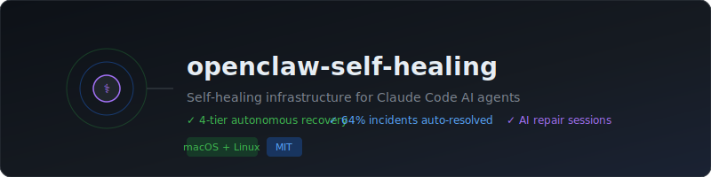
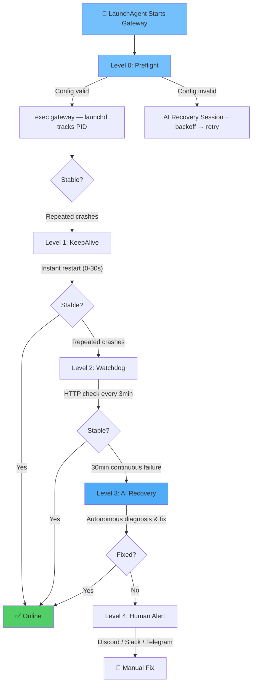
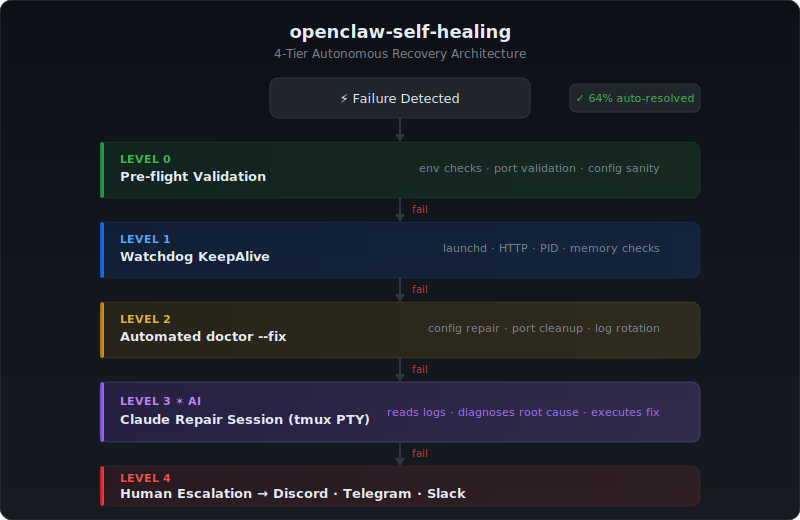

<div align="center">

# 🦞 OpenClaw Self-Healing System

### *Autonomous AI-Powered Recovery for Any Service*

**Stop getting paged at 3 AM. Let AI fix your crashes automatically.**

[](https://github.com/Ramsbaby/openclaw-self-healing/releases)
[](#-quick-start)
[](LICENSE)
[](https://github.com/ramsbaby/openclaw-self-healing/stargazers)
[](README.md)
[](README.md)
[](README.md)
[](https://github.com/Ramsbaby/openclaw-self-healing/actions/workflows/lint.yml)

[🚀 Quick Start](#-quick-start) · [🎬 Demo](#-demo) · [🏗️ Architecture](#️-architecture) · [📖 Docs](docs/)

</div>

<p align="center">
  
</p>

> If this saved your night 🌙, a ⭐ helps others find it.

---

## 🎬 Demo

<div align="center">


*4-tier recovery in action: KeepAlive → Watchdog → AI Doctor → Alert*

</div>

---

## 🔥 Why This Exists

> **This system wraps any long-running service with autonomous crash recovery.** OpenClaw Gateway is the primary example — a self-hosted AI gateway for Claude/GPT-4 routing — but the watchdog/recovery architecture adapts to any service.

Your service crashes at midnight. A basic watchdog restarts it — but what if the config is corrupted? The API rate limit hit? A dependency broken?

**Simple restart = crash loop.** You get paged. Your weekend is ruined.

**This system doesn't just restart — it understands and fixes root causes.**

---

## 🆚 Why openclaw-self-healing vs. rolling your own

| Feature | Basic Watchdog | supervisord | openclaw-self-healing |
|---------|---------------|-------------|----------------------|
| Auto-restart on crash | ✅ | ✅ | ✅ |
| HTTP health polling | ❌ | ❌ | ✅ |
| Crash loop prevention (backoff) | ❌ | partial | ✅ exponential backoff |
| Config validation before start | ❌ | ❌ | ✅ Level 0 preflight |
| **AI root-cause diagnosis** | ❌ | ❌ | ✅ Claude / GPT-4 / Gemini / Ollama |
| **Auto-fix corrupted config** | ❌ | ❌ | ✅ |
| Multi-channel alerts (Discord/Slack/Telegram) | ❌ | ❌ | ✅ |
| Prometheus metrics | ❌ | ❌ | ✅ |
| Works on macOS + Linux + Docker | partial | ✅ | ✅ |
| Zero vendor lock-in | ✅ | ✅ | ✅ MIT |

The gap that matters: when a crash loop is caused by something that can't be fixed by restarting alone, every other tool pages you. This one tries to fix it first.

---

## ⚡ Try It First (Dry Run)

Not ready to commit? Preview exactly what the installer will do — no changes made:

```bash
curl -fsSL https://raw.githubusercontent.com/Ramsbaby/openclaw-self-healing/main/install.sh | bash -s -- --dry-run
```

Sample output:

```
╔═══════════════════════════════════════════════════════════╗
║  🔍 DRY RUN — nothing will be installed or modified       ║
╚═══════════════════════════════════════════════════════════╝

[Pre-flight] All prerequisites present ✅

[Step 1] Directories that would be created: ~/.openclaw/...
[Step 2] Scripts that would be downloaded: gateway-watchdog.sh, ...
[Step 3] Environment file: ~/.openclaw/.env
[Step 4] LaunchAgents: ai.openclaw.watchdog, com.openclaw.healthcheck

  ✓ Level 0: Pre-flight validation              READY
  ✓ Level 1: KeepAlive (instant restart)         READY
  ✓ Level 2: Watchdog + HealthCheck (3-5 min)    READY
  ✓ Level 3: AI Emergency Recovery (auto-trigger) READY
  ✓ Level 4: Discord/Telegram Human Alert         READY

  Run without --dry-run to install.
```

---

## 🚀 Quick Start

### Prerequisites

- **macOS 12+** or **Linux** (Ubuntu 20.04+ / systemd) or **Docker**
- **[OpenClaw Gateway](https://github.com/openclaw/openclaw)** installed and running
- **Any major LLM** — Claude CLI (default), OpenAI, Gemini, or Ollama. See [LLM-Agnostic](#-llm-agnostic-recovery-new-in-v33)
- `tmux`, `jq` (`brew install tmux jq` or `apt install tmux jq`)

> **Note:** While this was built for OpenClaw Gateway, the watchdog/recovery architecture works for **any service**. See [docs/configuration.md](docs/configuration.md) to adapt it.

### Option 1: One-line Install (macOS / Linux)

```bash
curl -fsSL https://raw.githubusercontent.com/ramsbaby/openclaw-self-healing/main/install.sh | bash
```

The installer walks you through everything:

```
╔═══════════════════════════════════════════════╗
║  🦞 OpenClaw Self-Healing System Installer    ║
╚═══════════════════════════════════════════════╝

[1/6] Checking prerequisites...          ✅
[2/6] Creating directories...            ✅
[3/6] Installing scripts...              ✅
[4/6] Configuring environment..
      Discord webhook URL (optional): https://discord.com/api/webhooks/...
      Gateway port [18789]: 
      Gateway token (auto-detected): ✅
[5/6] Installing Watchdog LaunchAgent... ✅
[6/6] Verifying installation...
      Health check: HTTP 200 ✅
      Chain: Watchdog → HealthCheck → Emergency Recovery ✅

🎉 Self-Healing System Active!
```

### Option 2: Docker Compose

```bash
git clone https://github.com/Ramsbaby/openclaw-self-healing.git
cd openclaw-self-healing
cp .env.example .env   # edit with your config
docker compose up -d
```

> See [docs/DOCKER.md](docs/DOCKER.md) for full configuration guide.

### Verify It Works

```bash
# Kill your Gateway to test auto-recovery
kill -9 $(pgrep -f openclaw-gateway)

# Wait ~30 seconds, then check
curl http://localhost:18789/
# Expected: HTTP 200 ✅
```

---

## 🎬 How It Works

### 5-Tier Autonomous Recovery


```mermaid
graph TD
    A[🚀 LaunchAgent Starts Gateway] --> B[Level 0: Preflight]
    B -->|"Config valid"| C[exec gateway — launchd tracks PID]
    B -->|"Config invalid"| D[AI Recovery Session + backoff → retry]
    C --> E{Stable?}
    E -->|Repeated crashes| F[Level 1: KeepAlive]
    F -->|"Instant restart (0-30s)"| G{Stable?}
    G -->|Yes| Z[✅ Online]
    G -->|Repeated crashes| H[Level 2: Watchdog]
    H -->|"HTTP check every 3min"| I{Stable?}
    I -->|Yes| Z
    I -->|"30min continuous failure"| J[Level 3: AI Recovery]
    J -->|"Autonomous diagnosis & fix"| K{Fixed?}
    K -->|Yes| Z
    K -->|No| L[Level 4: Human Alert]
    L -->|"Discord / Slack / Telegram"| M[👤 Manual Fix]

    style A fill:#74c0fc
    style B fill:#74c0fc
    style Z fill:#51cf66
    style J fill:#4dabf7
```

### Each Level Explained

| Level | What | When | How |
|-------|------|------|-----|
| **0** | Preflight Validation | Every cold start | Validate binary, .env keys, JSON configs before exec |
| **1** | LaunchAgent KeepAlive | Any crash | Instant restart (0–30s) |
| **2** | Watchdog v4.1 + HealthCheck | Repeated crashes | PID + HTTP + memory monitoring, exponential backoff |
| **3** | AI Emergency Recovery | 30min continuous failure | PTY session → log analysis → auto-fix (Claude/GPT-4/Gemini/Ollama) |
| **4** | Human Alert | All automation fails | Discord/Slack/Telegram with full context |

**Level 0 (new in v3.2):** Catches config corruption, missing .env keys, and broken JSON *before* the gateway even starts — preventing crash loops from bad config entirely.

---

## 📊 Real Production Numbers

Based on an audit of 14 real incidents (Feb 2026):

| Scenario | Result |
|----------|--------|
| 17 consecutive crashes | ✅ Full recovery via Level 1 |
| Config corruption | ✅ Auto-fixed in ~3 min |
| All services killed (nuclear) | ✅ Recovered in ~3 min |
| 38+ crash loop | ⛔ Stopped by design (prevents infinite loops) |

**9 of 14 incidents resolved fully autonomously.** The remaining 5 escalated correctly to Level 4 — the system worked as designed.

---

## 🏗️ Architecture

<p align="center">
  
</p>

```
Level 0: Preflight 🔍 (every cold start)
│  Validates binary, .env keys, JSON configs before exec
│  On failure: AI recovery session (tmux) + exponential backoff
│  scripts/gateway-preflight.sh
│
▼  passes
Level 1: KeepAlive ⚡ (0-30s)
│  Instant restart on any crash
│  Built into ai.openclaw.gateway.plist
│
▼  repeated failures
Level 2: Watchdog v4.1 🔍 (3-5 min)
│  HTTP + PID + memory monitoring every 3 min
│  Exponential backoff: 10s → 30s → 90s → 180s → 600s
│  Crash counter auto-decay after 6 hours
│
▼  30 minutes of continuous failure
Level 3: AI Emergency Recovery 🧠 (5-30 min)
│  Auto-triggered — no manual intervention
│  Supports Claude, GPT-4, Gemini, Ollama (OPENCLAW_LLM_PROVIDER)
│  PTY session: reads logs → diagnoses → fixes
│  Documents learnings for future incidents
│
▼  all automation fails
Level 4: Human Alert 🚨
   Discord/Slack/Telegram notification with full context
   Log paths + recovery report attached
```

### 📢 Multi-Channel Notifications

Unified notification library supporting **Discord**, **Slack**, **Telegram**, and extensible adapters — one config, all channels.

```bash
# Auto-detects channel from available env vars
# Set one (or more) of:
DISCORD_WEBHOOK_URL="https://discord.com/api/webhooks/..."
SLACK_WEBHOOK_URL="https://hooks.slack.com/services/..."
TELEGRAM_BOT_TOKEN="..."  # + TELEGRAM_CHAT_ID

# Or explicitly force a channel
NOTIFICATION_CHANNEL="slack"
```

Implementation: [`scripts/lib/notify.sh`](scripts/lib/notify.sh)

### Scripts Reference

| Script | Level | Purpose |
|--------|-------|---------|
| `scripts/gateway-preflight.sh` | 0 | Proactive config validation before service start |
| `scripts/gateway-watchdog.sh` | 2 | Reactive recovery after crash detection |
| `scripts/gateway-healthcheck.sh` | 2 | HTTP health polling + Level 3 escalation |
| `scripts/emergency-recovery-v2.sh` | 3 | AI autonomous diagnosis and repair |
| `scripts/emergency-recovery-monitor.sh` | 3 | Monitor active recovery sessions |
| `scripts/incident-digest.sh` | ops | Weekly incident report with autonomy rate |
| `scripts/lib/llm-gateway.sh` | 3 | LLM-agnostic wrapper (Claude/GPT-4/Gemini/Ollama) |
| `scripts/lib/notify.sh` | all | Unified notification dispatcher (Discord/Slack/Telegram) |
| `scripts/prometheus-exporter.py` | obs | Prometheus metrics HTTP server |
| `scripts/start-metrics-exporter.sh` | obs | Start/stop/status for the metrics exporter |

---

## ✅ What v3.4 Added

| Before v3.4 | After v3.4 |
|-------------|------------|
| Docker users had to adapt manually | Docker Compose support with gateway + watchdog services |
| Discord-only in some scripts | Unified `notify.sh` library (Discord/Slack/Telegram) |

### Previous: What v3.2 Added

| Before v3.2 | After v3.2 |
|-------------|------------|
| Config corruption caused crash loops at start | Preflight catches it before exec |
| `ANTHROPIC_API_KEY` silently missing in tmux sessions spawned from launchd | Key forwarded via `tmux -e` flag |
| No proactive validation layer | Level 0: gateway-preflight.sh |

### Previous: What v3.1 Fixed

| Before v3.1 | After v3.1 |
|-------------|------------|
| Manual LaunchAgent/systemd setup | `install.sh` does everything |
| `.env` had to be created by hand | Interactive wizard generates it |
| Level 2 → Level 3 was disconnected | Auto-triggers after 30 min |
| macOS only | macOS + Linux (systemd) |
| Install often failed mid-way | Verified end-to-end |

---

## 🤖 LLM-Agnostic Recovery (New in v3.3)

Level 3 Emergency Recovery is no longer Claude-only. Set `OPENCLAW_LLM_PROVIDER` in your `.env`:

| Provider | Config | Default model | Requires |
|----------|--------|---------------|----------|
| **Claude** (default) | `OPENCLAW_LLM_PROVIDER=claude` | Claude Code CLI | Claude Max subscription |
| **OpenAI** | `OPENCLAW_LLM_PROVIDER=openai` | `gpt-4o` | `OPENAI_API_KEY` + `pip install openai` |
| **Google Gemini** | `OPENCLAW_LLM_PROVIDER=gemini` | `gemini-2.0-flash` | `GOOGLE_API_KEY` + `pip install google-generativeai` |
| **Ollama** (local/offline) | `OPENCLAW_LLM_PROVIDER=ollama` | `llama3.2` | Ollama running locally |

```bash
# Switch to GPT-4o
echo 'OPENCLAW_LLM_PROVIDER=openai' >> ~/.openclaw/.env
echo 'OPENAI_API_KEY=sk-...'        >> ~/.openclaw/.env

# Fully offline with Ollama (no API key needed)
echo 'OPENCLAW_LLM_PROVIDER=ollama' >> ~/.openclaw/.env
echo 'OPENCLAW_LLM_MODEL=llama3.2'  >> ~/.openclaw/.env
```

Implementation: [`scripts/lib/llm-gateway.sh`](scripts/lib/llm-gateway.sh)

---

## 📈 Prometheus Metrics (New in v3.3)

Expose real-time recovery metrics for Grafana dashboards and alerting rules.

| Metric | Type | Description |
|--------|------|-------------|
| `openclaw_gateway_healthy` | gauge | 1 if gateway returns HTTP 200, 0 otherwise |
| `openclaw_recovery_attempts` | gauge | Total Level-3 recovery attempts |
| `openclaw_recovery_success` | gauge | Successful recoveries |
| `openclaw_recovery_failed` | gauge | Failed recoveries |
| `openclaw_recovery_rate_percent` | gauge | Autonomous recovery success rate (0–100) |
| `openclaw_last_recovery_duration_seconds` | gauge | Duration of last recovery attempt |
| `openclaw_last_recovery_success` | gauge | 1 if last recovery succeeded, 0 if failed |
| `openclaw_last_recovery_timestamp_seconds` | gauge | Unix timestamp of last recovery |

```bash
# Start the exporter (port 9090 by default)
bash scripts/start-metrics-exporter.sh start

# Test
curl -s http://localhost:9090/metrics

# Stop / restart
bash scripts/start-metrics-exporter.sh stop
bash scripts/start-metrics-exporter.sh restart

# Custom port
OPENCLAW_METRICS_PORT=8080 bash scripts/start-metrics-exporter.sh start
```

### Prometheus scrape config

```yaml
# prometheus.yml
scrape_configs:
  - job_name: 'openclaw'
    static_configs:
      - targets: ['localhost:9090']
    scrape_interval: 30s
```

### Grafana alerting example

```
# Alert: gateway down for >5 minutes
openclaw_gateway_healthy == 0

# Alert: recovery rate drops below 50%
openclaw_recovery_rate_percent < 50
```

Implementation: [`scripts/prometheus-exporter.py`](scripts/prometheus-exporter.py) · [`scripts/start-metrics-exporter.sh`](scripts/start-metrics-exporter.sh)

---

## 📊 Weekly Incident Digest

Generate a Markdown report of the last 7 days of incidents:

```bash
# Print to stdout
bash scripts/incident-digest.sh

# Print + post to Discord
bash scripts/incident-digest.sh --discord
```

Sample output:

```markdown
## 📊 Weekly Incident Digest

**Period**: 2026-03-18 → 2026-03-25

| Metric | Value |
|--------|-------|
| Total incidents | 7 |
| Auto-resolved | 5 (71%) |
| Escalated to human | 2 |
| Autonomy rate | 71% |

✅ System performing well (autonomy rate on target)
```

---

## 🗺️ Roadmap

**✅ Done:** 4-tier architecture · Claude AI integration · `install.sh` automation · Linux systemd · Level 2→3 auto-escalation · Discord/Telegram alerts · Preflight validation (v3.2) · **LLM-agnostic layer — Claude, GPT-4, Gemini, Ollama (v3.3)** · **Prometheus metrics exporter (v3.3)** · **Multi-channel notifications — Discord/Slack/Telegram (v3.4)** · **Docker Compose support (v3.4)** · **`--dry-run` demo mode** · **Weekly incident digest**

**🚧 Next:** Grafana dashboard template · Multi-node clusters

**🔮 Future:** Kubernetes Operator

[🗳️ Vote on features →](https://github.com/ramsbaby/openclaw-self-healing/discussions)

---

## 💬 Community

Found this useful? A ⭐ on GitHub helps others discover it.

- [💬 Discussions](https://github.com/ramsbaby/openclaw-self-healing/discussions) — questions, ideas, show-and-tell
- [🐛 Issues](https://github.com/ramsbaby/openclaw-self-healing/issues) — bug reports and feature requests
- [🤝 Contributing](CONTRIBUTING.md) — PRs welcome

---

## 📚 Docs

| | |
|---|---|
| [📖 Quick Start](docs/QUICKSTART.md) | Installation guide |
| [🏗️ Architecture](docs/architecture.md) | System design |
| [🔧 Configuration](docs/configuration.md) | Environment variables |
| [🐳 Docker](docs/DOCKER.md) | Docker Compose setup |
| [🐛 Troubleshooting](docs/TROUBLESHOOTING.md) | Common issues |
| [📜 Changelog](CHANGELOG.md) | Version history |

---

## 🔒 Security

No secrets in code. `.env` for all webhooks. Lock files prevent races. All recoveries logged.

Level 3 AI access: OpenClaw config, gateway restart, log files — intentional for autonomous recovery.

---

## 🌐 OpenClaw Ecosystem

| Project | Role |
|---------|------|
| **[openclaw-self-healing](https://github.com/Ramsbaby/openclaw-self-healing)** ← you are here | 4-tier autonomous crash recovery |
| **[openclaw-memorybox](https://github.com/Ramsbaby/openclaw-memorybox)** | Memory hygiene CLI — prevents the bloat that causes crashes |
| **[openclaw-self-evolving](https://github.com/Ramsbaby/openclaw-self-evolving)** | AI agent that proposes its own AGENTS.md improvements |
| **[jarvis](https://github.com/Ramsbaby/jarvis)** | 24/7 AI ops system using Claude Max — self-healing, RAG, cron automation |

All MIT licensed, all battle-tested on the same 24/7 production instance.

---

## 🤝 Contributing

Bug reports, feature requests, docs improvements welcome. [📋 Contribution Guide →](CONTRIBUTING.md)

**Community:** [Discussions](https://github.com/ramsbaby/openclaw-self-healing/discussions) · [Issues](https://github.com/ramsbaby/openclaw-self-healing/issues) · [Discord](https://discord.com/invite/clawd)

---

<div align="center">

**MIT License** · Made with 🦞 by [@ramsbaby](https://github.com/ramsbaby)

*"The best system is one that fixes itself before you notice it's broken."*

</div>
