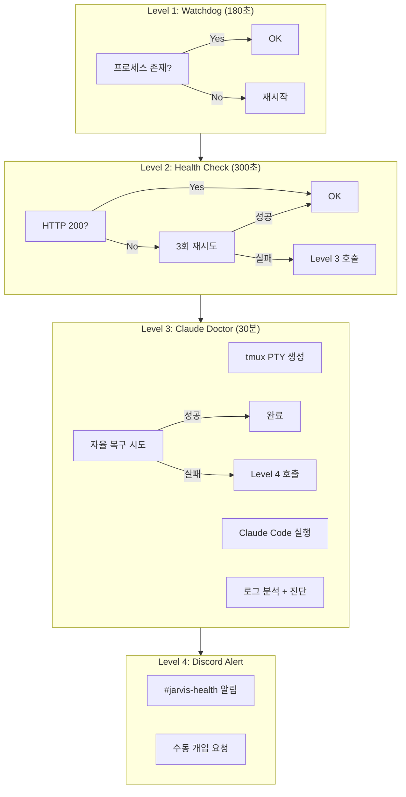

## TL;DR

- **증상**: OpenClaw Gateway 장애 시 수동 복구 필요, 야간 장애 대응 불가
- **원인**: 프로세스 감시만으론 HTTP 레벨 장애 미감지
- **해결**: 4-Tier 자가복구 (Watchdog → Health Check → Claude Doctor → Alert)
- **효과**: 평균 복구 시간 30분 → 5분, 야간 장애 대응 자동화
- **한계**: Claude API 비용, 복잡한 장애는 여전히 수동 개입 필요

---

## 글을 쓰게 된 계기

"자비스, 왜 대답을 안 해?"

새벽 2시, 잠결에 보낸 메시지에 답이 없었다. 아침에 일어나보니 OpenClaw Gateway가 죽어있었다. 수정 3분, 원인 파악 3시간. 이런 일이 한두 번이 아니었다.

프로세스는 살아있는데 HTTP 응답이 없는 경우, 메모리는 충분한데 API 타임아웃이 나는 경우... 단순한 프로세스 감시로는 잡을 수 없는 장애들이었다.

"AI가 24시간 돌아가야 하는데, AI를 감시하는 건 누가 하지?"

그래서 만들었다. **AI가 AI를 치료하는 시스템**.

---

## 배경: 왜 기존 방식으론 부족했나

### 기존 구조 (Level 1만 존재)

```
macOS LaunchAgent (Watchdog)
    ↓
프로세스 존재 여부만 체크 (180초 간격)
    ↓
프로세스 없으면 재시작
```

**문제점:**

1. 프로세스는 살아있지만 HTTP 응답 없음 → 미감지
2. 메모리 누수로 느려진 상태 → 미감지
3. API 타임아웃 반복 → 미감지
4. 장애 원인 파악 → 수동으로 로그 분석 필요

### 실제 장애 사례 (2026-02-05)

```
19:30 - Gateway 프로세스 정상 (Watchdog: OK)
19:35 - HTTP 응답 5초 초과 (사용자: "자비스 왜 느려?")
19:40 - API 타임아웃 시작 (크론 실패)
19:45 - 수동으로 발견, 재시작
```

Watchdog은 프로세스가 살아있다고 판단했지만, 실제로는 서비스 불능 상태였다.

---

## 설계: 4-Tier 에스컬레이션 아키텍처

"싼 검사부터 하고, 비싼 의사는 마지막에 부른다"



### 왜 4단계인가?

| Level | 비용 | 속도 | 역할 |
|-------|------|------|------|
| 1 | 거의 0 | 즉시 | 프로세스 감시 |
| 2 | 낮음 | 5초 | HTTP 상태 확인 |
| 3 | 높음 (Claude API) | 최대 30분 | AI 진단/복구 |
| 4 | 0 | 즉시 | 인간 호출 |

**핵심 원칙**: 비싼 리소스(Claude)는 싼 검사(HTTP 체크)가 실패했을 때만 호출

---

## 구현: Level 3 Claude Doctor

이게 이 시스템의 핵심이다. **Claude Code를 자율 복구 의사로 활용**.

### 왜 Claude Code인가?

1. **터미널 제어 가능**: tmux PTY에서 실제 명령어 실행
2. **맥락 이해**: 로그를 읽고 원인을 추론
3. **자율 판단**: 어떤 명령을 실행할지 스스로 결정
4. **안전 장치**: 위험한 명령은 실행 안 함 (rm -rf 등)

### 작동 흐름

```bash
# Level 2 실패 시 자동 실행
tmux new-session -d -s "emergency-recovery"
tmux send-keys "claude --dangerously-skip-permissions" Enter
tmux send-keys "OpenClaw Gateway 장애 복구 시작. 
로그 확인: tail -100 ~/.openclaw/logs/*.log
설정 확인: cat ~/.openclaw/openclaw.json
프로세스: ps aux | grep openclaw
진단 후 복구 시도하세요." Enter
```

Claude는 이 프롬프트를 받고:

1. 로그 파일 분석
2. 에러 패턴 식별
3. 설정 파일 검증
4. 복구 명령 실행 (openclaw gateway restart 등)
5. 복구 확인 (HTTP 200 체크)

### 실제 복구 로그 (2026-02-05 19:37)

```
[Claude] 로그 분석 중...
[Claude] 발견: "ECONNREFUSED" 반복 - API 연결 실패
[Claude] 원인 추정: Gateway 프로세스 좀비 상태
[Claude] 조치: pkill -f "openclaw" && sleep 2 && openclaw gateway start
[Claude] 확인: curl localhost:18789/health → 200 OK
[Claude] 복구 완료. 소요 시간: 47초
```

---

## Trade-off 분석

| 선택지 | 장점 | 단점 | 결정 |
|--------|------|------|------|
| Level 3 없이 바로 알림 | 단순, 비용 0 | 야간 대응 불가 | ❌ |
| 규칙 기반 자동 복구 | 빠름, 예측 가능 | 새로운 장애 대응 불가 | ❌ |
| Claude Doctor | 지능적 대응 | API 비용, 30분 제한 | ✅ |

**결정 근거**: 야간 장애 대응 자동화 > API 비용

---

## 시스템 점검 체크리스트

내 시스템에 적용하기 전 확인할 것:

- [ ] macOS LaunchAgent 설정 가능한가?
- [ ] Claude API 키 있는가?
- [ ] Discord Webhook URL 있는가?
- [ ] tmux 설치되어 있는가?
- [ ] 30분간 Claude 실행 비용 감당 가능한가?

---

## 마무리: AI가 AI를 치료하는 시대

"자비스가 죽으면 자비스가 살린다"

이 시스템을 만들고 나서 야간 장애 대응이 자동화됐다. 물론 완벽하진 않다. 복잡한 설정 오류나 네트워크 문제는 여전히 수동 개입이 필요하다.

하지만 "프로세스는 살아있는데 왜 안 돼?"라는 상황은 이제 Claude가 알아서 진단한다.

**다음 편 예고**: Claude Code를 Level 3 의사로 활용하기 - tmux PTY 제어와 안전 장치

---

#### 읽어주셔서 감사합니다.🖐


